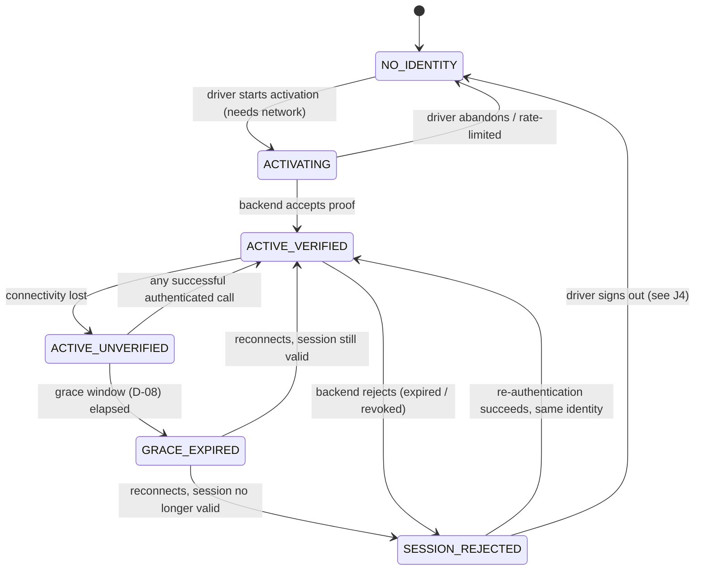
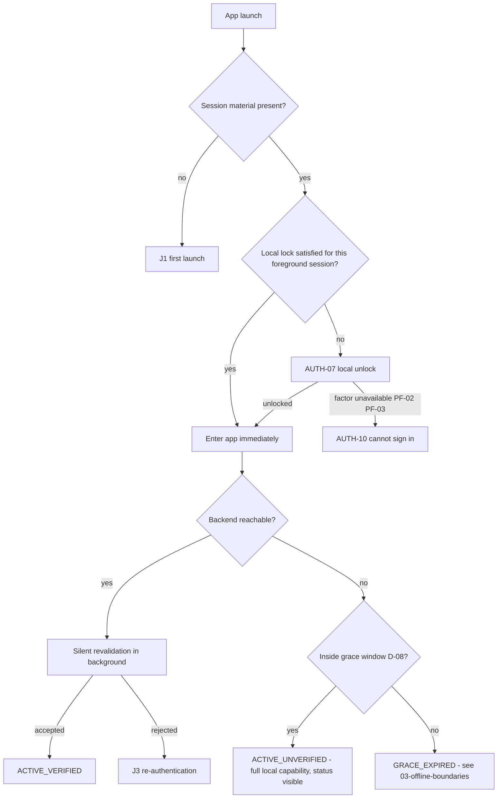

# 01 — The Driver authentication journey

Four journeys: **first launch**, **session restore**, **re-authentication**, **sign-out**.

Tags follow [`README.md`](README.md): **FACT**, **PLATFORM**, **PROPOSAL**, **ASSUMPTION**.
Identifiers (`F-`, `PF-`, `A-`, `S-`) are defined in
[`04-facts-and-assumptions.md`](04-facts-and-assumptions.md). Sub-decision identifiers (`D-`) are
defined in [`05-open-001-decision-alternatives.md`](05-open-001-decision-alternatives.md).

---

## 0. The client session model these journeys assume

**PROPOSAL.** The journeys below need a shared vocabulary for "what state is this device in". The
model is proposed, not canonical, but every option in `OPEN-001` needs *some* model of this kind,
and naming it is what makes the offline boundary in
[`03-offline-boundaries.md`](03-offline-boundaries.md) expressible at all.

Two independent axes. Conflating them is the classic mistake in offline authentication design.

**Axis 1 — server standing.** What the *backend* thinks of this device's session.

| State | Meaning |
|---|---|
| `NO_IDENTITY` | The device holds no session material. It has never been activated, or it was signed out and cleared. |
| `ACTIVATING` | An activation attempt is in flight. |
| `ACTIVE_VERIFIED` | Session material is present and the backend accepted it within the offline grace window (D-08). |
| `ACTIVE_UNVERIFIED` | Session material is present. The backend has not been reached recently, but the device is still inside the grace window. **The app believes it is authenticated; it does not know it.** |
| `GRACE_EXPIRED` | Session material is present, but the grace window has passed with no server contact. The app has stopped believing. |
| `SESSION_REJECTED` | The backend explicitly rejected the session — expired, revoked, membership disabled. The app *knows* it is not authenticated. |

**Axis 2 — local lock.** Whether the person holding the phone has satisfied the device-local
unlock factor (D-04).

| State | Meaning |
|---|---|
| `UNLOCKED` | The local factor has been satisfied for this foreground session. |
| `LOCKED` | It has not. The app shows the unlock screen over whatever the server standing is. |
| `LOCK_UNAVAILABLE` | The local factor cannot be used at all — no biometric enrolment, or the biometric-gated key was invalidated by an enrolment change (**PLATFORM** PF-02, PF-03). |

The two axes are independent. `ACTIVE_UNVERIFIED` + `LOCKED` is the normal state of a phone in a
pocket in a dead zone. `GRACE_EXPIRED` + `UNLOCKED` is a driver who can see their data but can no
longer be trusted to be who they say they are.



**Note the arrow that does not exist.** Nothing moves from `NO_IDENTITY` to any active state
without the network. That is the hard boundary, and section 1 of
[`03-offline-boundaries.md`](03-offline-boundaries.md) is about why it must stay hard.

---

## J1 — First launch on this device

**Precondition:** `NO_IDENTITY`. This is the state of a factory-fresh phone, a reinstalled app, a
replacement handset, and any phone whose data was cleared — **FACT** F-27 means backup and device
transfer restore nothing, so this journey runs more often than "once per driver" (**PLATFORM**
PF-06).

**Preceding facts.** A Driver cannot exist outside a Company (**FACT** F-07, F-08, F-09), so
first launch is always a driver joining a Company that already holds a record of them
(**ASSUMPTION** A-10, A-11 — this is structurally implied but not stated; see D-02).

### Steps

| # | Step | Screen | Option-dependent? |
|---|---|---|---|
| 1 | Choose interface language | `AUTH-00` | D-15 |
| 2 | Enter identifier | `AUTH-02` | D-01 |
| 3 | Prove it | `AUTH-03` (secret) and/or `AUTH-04` (OTP) | **D-03 — the central choice** |
| 4 | Choose Company, only if more than one active membership | `AUTH-05` | D-05 |
| 5 | Set up device unlock | `AUTH-06` | D-04, D-06 |
| 6 | Land on the driver home surface | (outside this lane) | — |

### Design intent per step

**Step 1 — language before anything else.** **PROPOSAL.** The language selector must appear
*before* the first field, not in a settings screen behind sign-in. A driver who cannot read the
sign-in screen cannot reach settings. Two large, equally-weighted options rendered in their own
script — `O'zbekcha` / `Русский` — plus whatever the device locale already implies as the
pre-selected one. This is one tap, once, and it is never asked again unless the driver changes it.
**S-16** records that no canonical document places this choice anywhere.

**Step 2 — one field, one keyboard.** **PROPOSAL.** Whatever D-01 resolves to, the screen shows
exactly one input, a numeric keypad if the identifier is numeric, a country prefix rendered as
fixed text rather than a picker if the identifier is a phone number, and a single full-width
primary action in the lower third of the screen where a thumb reaches it. No "remember me", no
secondary links competing with the primary action, no logo occupying the space the keyboard will
take.

**Step 3 — the proof.** This is where `OPEN-001` actually bites. The journey is drawn here in the
shape it takes under each D-03 option:

```
D-03 Option A — password only
  AUTH-02 identifier -> AUTH-03 secret -> (D-05?) -> AUTH-06

D-03 Option B — OTP only
  AUTH-02 identifier -> AUTH-04 code -> (D-05?) -> AUTH-06

D-03 Option C — password + OTP on an unrecognised device
  AUTH-02 identifier -> AUTH-03 secret -> AUTH-04 code -> (D-05?) -> AUTH-06

D-03 Option D — company-issued activation code, then device-local factor
  AUTH-02 identifier -> AUTH-03 activation code -> (D-05?) -> AUTH-06
```

The screens are the same set; only the path through them differs. That is deliberate: the
screen and state inventory in [`02-screen-state-inventory.md`](02-screen-state-inventory.md) is
built once and survives whichever option the ADR takes.

**Step 4 — Company only when it is a real question.** **PROPOSAL.** If the identity has exactly
one active `CompanyMember` (**FACT** F-09), the client selects it and shows no screen. The
selector appears only for a genuinely multi-membership identity. **FACT** F-10 records that the
canonical roadmap names the client task `auth/company shell`, which is the strongest available
evidence that a company step is expected to exist; **S-07** records that whether a driver may hold
more than one membership is never stated. The screen is specified so that the answer "yes, they
can" costs nothing later, and the answer "no, never" costs one deleted screen.

**Step 5 — device unlock setup, offered not imposed.** **PROPOSAL.** Immediately after the first
successful activation, while the driver is already stationary and attentive, offer the local
unlock factor. The offer states what it buys in the driver's terms — *"so you do not type this
again"* — not in security terms. It must be skippable, because **PLATFORM** PF-02 means some
devices cannot honour it, and a driver who skips must land somewhere that still works (D-04).

### What must never happen in J1

- The driver must never be told, at any point, that they are signed in when no backend accepted
  their proof. **FACT** F-18 requires local-first acceptance of *writes*; it says nothing that
  permits local-first acceptance of *identity*, and the two are not the same thing. See
  [`03-offline-boundaries.md`](03-offline-boundaries.md) section 1.
- The identifier screen must never reveal whether the identifier is known to the system. **FACT**
  F-12 makes non-disclosure an accepted platform property; a sign-in screen that says "no such
  driver" is the same disclosure by another route.

---

## J2 — Session restore (every subsequent launch)

**Precondition:** the device holds session material. This is the overwhelmingly common journey —
it runs every time the driver opens the app, several times a day, usually one-handed, usually in
motion, frequently with no network.



### Design intent

**The app opens into the app, not into a gate.** **PROPOSAL.** Revalidation with the backend is a
background activity; it never blocks the first frame. **FACT** F-18 establishes that a screen never
blocks on the network, and while that rule is written about writes, applying it to session restore
is the same principle: a driver reaching for the app at a loading bay has a task, and the app's
first duty is to let them get to it.

**Local unlock is the only thing allowed to block, and it is one gesture.** Biometric prompt on
launch, resolving in under a second on a working sensor, with a visible fallback for the driver
whose gloves or wet hands defeat it (D-04). The fallback must be reachable **without** waiting out
several failed biometric attempts.

**Connection standing is always visible and never alarming.** **PROPOSAL.** A persistent, quiet
status affordance carries three things at once: connectivity, session standing, and queue depth.
`ACTIVE_UNVERIFIED` is *normal* (**FACT** F-19) and must be styled as normal — informational, not
red, not a banner that steals a tap. `GRACE_EXPIRED` is the first state that earns visual weight.

**Silence is not an outcome.** If revalidation fails for a reason the client cannot interpret —
which is today's situation, because **FACT** F-13 and F-14 mean no authentication error code
exists — the client must not guess. It shows a state meaning *"could not confirm your session"* and
keeps the driver working inside the grace window. Guessing "your session expired" and signing the
driver out would be a worse failure than saying nothing, because it is a lie the driver acts on.
This is the concrete field cost of **A-04** being unmet.

---

## J3 — Re-authentication

Triggered when the server standing becomes `SESSION_REJECTED`, or when `GRACE_EXPIRED` is reached
and connectivity returns to a rejection. It also covers whatever additional triggers D-09 adds.

### The rule that shapes this journey

**PROPOSAL, resting on FACT F-23.** Re-authentication **never** clears local state, never empties
the queue, and never returns the driver to a cold first-launch screen. The device already knows who
it was and which Company it belonged to. Losing a session is not losing an identity, and the local
database holds accepted driver work that must survive (**FACT** F-23).

Concretely: re-authentication is a **modal over the app**, showing the driver's own identifier
already filled in and asking only for the proof. It is not `AUTH-02`.

```
SESSION_REJECTED
      |
      v
AUTH-08  "Confirm it is you"  -- identifier shown, not re-typed
      |                          queue depth shown: "3 items waiting to send"
      +-- proof accepted, same identity ----> ACTIVE_VERIFIED, queue resumes
      |
      +-- proof accepted, DIFFERENT identity -> see J4 section "identity switch"
      |
      +-- offline ---------------------------> AUTH-11 connection required,
      |                                        local data intact, queue held
      |
      +-- rate-limited ----------------------> AUTH-09 blocked, with a time
      |
      +-- membership disabled ---------------> AUTH-10 cannot sign in, with
                                               what to do (D-12), queue held
```

### What the driver sees, in order of importance

1. **Their work is safe.** The first line of `AUTH-08` addresses the queue, not the credential:
   *"3 records are waiting to send. Confirm it is you to continue."* **FACT** F-18 means the driver
   was already told those writes were accepted; the re-authentication screen is the moment they are
   most likely to fear otherwise.
2. **What is needed.** One field.
3. **What if they cannot.** One clearly reachable route to `AUTH-10` (D-12).

### The interaction with OPEN-002 that must not be papered over

**FACT** F-24 and F-25: the client has a mechanism for permanently failed work but no policy, and
`OPEN-002` is unresolved. A session rejection that arrives while operations are queued is exactly
the collision point. Two questions belong to `OPEN-002` and are **not** answered here:

- Does a rejected session make queued operations retryable-later, or terminal?
- If the driver never re-authenticates on this device, what becomes of the business facts in that
  queue, and who is accountable for them?

This package records the collision and refuses to resolve it. See
[`03-offline-boundaries.md`](03-offline-boundaries.md) section 5.

---

## J4 — Sign-out

**The most dangerous screen in the package**, because the obvious implementation destroys accepted
driver work.

### The constraint

**FACT** F-23: the local database holds accepted driver writes, and wiping it discards work the
driver was told was accepted. **FACT** F-18: the driver *was* told. **FACT** F-20: an item is
`SYNCED` only after backend confirmation, so a queued item is precisely a promise not yet kept.

**DERIVED, and the extension is a real step worth naming.** F-23 is written about *schema
migrations* — it forbids a destructive migration discarding accepted work. Sign-out is not a
migration. Extending F-23 to it is an inference: both are cases of the app deleting a local database
that holds writes the driver was told were accepted, and F-23's stated reason ("wiping it discards
work the driver was told was accepted") applies identically to both. The inference is short and this
package believes it holds, but a reader is entitled to reject it — in which case sign-out's
behaviour is governed by nothing canonical at all, which makes D-10 more open rather than less.

On that reading: a sign-out that clears local state while the queue is non-empty breaks a promise the
product already made. A sign-out that leaves another driver's data readable on a shared device
breaks company isolation expectations (**FACT** F-07). Both are real; the design has to choose
between them explicitly rather than by accident.

### Proposed behaviour

**PROPOSAL.** Sign-out has three distinct outcomes, and which one applies depends on the queue,
not on the driver's phrasing:

| Situation | Behaviour |
|---|---|
| Queue empty, online | Sign out normally. Session material destroyed. Local business data cleared. `NO_IDENTITY`. |
| Queue non-empty, online | Offer to send first. Show the count and a progress state. Sign out when the queue drains. This is the path that should be easiest to take. |
| Queue non-empty, offline | **Destructive confirmation.** The dialog names the exact count and what is lost, in the driver's language, and requires a deliberate second action. The default action is *cancel*. |

The destructive confirmation must state the consequence as a fact about the driver's work, not as
a warning about data: *"3 expense records have not reached the office. If you sign out now they
will be lost and cannot be recovered."* **PROPOSAL** — the wording is the designer's. The
obligation behind it is **DERIVED**: **FACT** F-23 forbids accepted driver work being discarded
silently, and naming the count is how this design discharges that. F-23 specifies no dialog, no
count and no driver-facing wording.

**A fourth option deserves consideration and is offered to the ADR (D-10):** sign-out that
*retains* the queue against the original identity and refuses to discard it, deferring the choice
until connectivity returns. It is safer for the business fact and worse for the shared-device case.

### Identity switch on a shared device

**PROPOSAL, and a hazard worth the ADR author's attention.** A single truck phone used by two
drivers is a realistic deployment in this market. When driver B signs in on a device where driver
A's queue is non-empty:

- The queued operations belong to A. **FACT** F-21 makes the server-side idempotency key
  `(company_id, operation, client_request_id)` — it carries the company, not the author. **FACT**
  F-22 forbids regenerating the key. So the operations remain replayable, but nothing in the
  canonical material says what the backend does with A's work arriving under B's session
  (**ASSUMPTION** A-07).
- Silently sending A's work under B's session would misattribute a business fact, and financial
  facts are append-only and audited (**FACT** F-32; `product/business-rules-uz.md` non-negotiables
  #3 and #8).

This design therefore **blocks the switch** until A's queue is resolved, and surfaces it as
A's problem to finish rather than B's problem to inherit. That is a proposal. The underlying
question — what the backend does with work authored by another identity — is **A-07** and belongs
to `OPEN-001`/`OPEN-002` jointly, not to this file.

---

## Journey-level summary of what stays open

| Journey | Fully specifiable today | Blocked on |
|---|---|---|
| J1 first launch | Screen sequence, states, ergonomics, non-disclosure behaviour | D-01, D-02, D-03, D-05, D-13 |
| J2 session restore | Non-blocking restore, lock model, status visibility | D-04, D-07, D-08, and critically A-04 |
| J3 re-authentication | Modal shape, queue-first messaging, no state loss | D-09, D-11, D-14, plus `OPEN-002` |
| J4 sign-out | Three outcomes, destructive confirmation, identity-switch block | D-10, A-07, plus `OPEN-002` |
