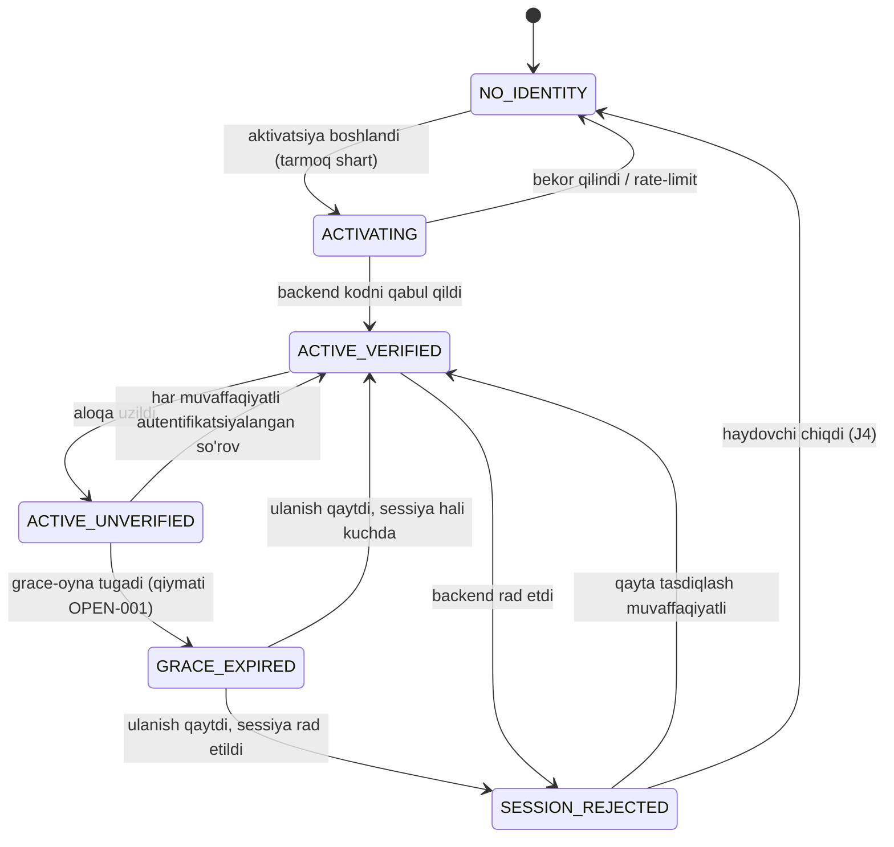
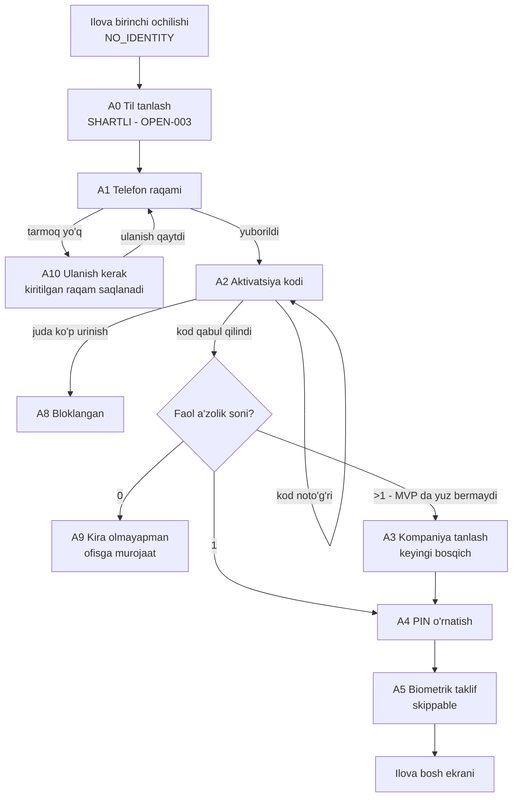
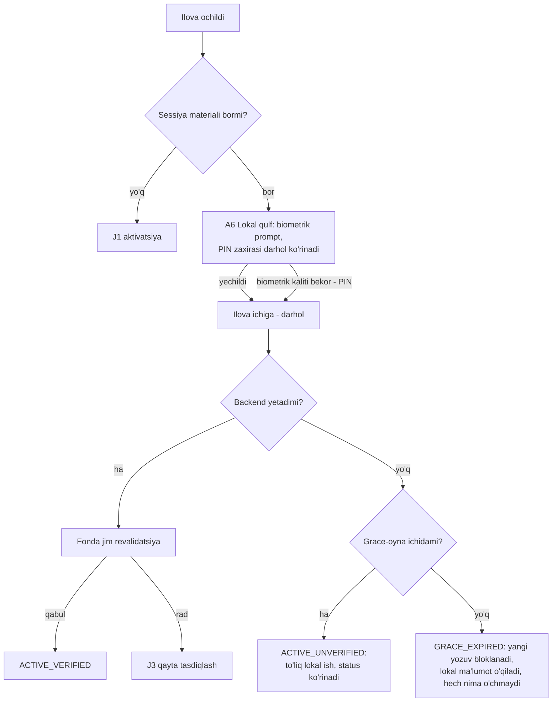

# DS-01 — Haydovchi kirish oqimi

Teg konvensiyasi va holatlar katalogi: [`README.md`](README.md). Ekran spetsifikatsiyalari:
[`ds-01-ekranlar.md`](ds-01-ekranlar.md). Komponentlar: [`ds-01-komponentlar.md`](ds-01-komponentlar.md).

## 0. Kanon chegaralar — bu hujjat nima ustiga quriladi

- [FAKT: sessiya prompti; `architecture/system.md` §Backend] Haydovchi **hech qachon parol
  ko'rmaydi**: telefon raqami → bir martalik aktivatsiya kodi → qurilmada PIN/biometrik.
- [FAKT: sessiya prompti] Xato ekranlari **raqam ro'yxatdan o'tganini oshkor qilmaydi**
  (enumeration-oracle taqiqi; `ai/MASTER_PROMPT.md` §12 ham shuni talab qiladi).
- [FAKT: `product/vision.md` §O'zgarmas haqiqatlar 4] Ilova offline-first: yozuv avval lokalda
  qabul qilinadi; qabul qilingan ish hech qachon yo'qolmaydi.
- [FAKT: `product/business-rules.md` #10] Biznes qoidasi frontend'ga tashlanmaydi — klient
  serverdan kelgan holat va ruxsatni ko'rsatadi. Shu sababli bu dizayn hech qaerda o'zi
  urinishlar sonini sanamaydi, countdown o'ylab topmaydi, PIN qoidasini belgilamaydi.
- [FAKT: `product/business-rules.md` #1; `ai/MASTER_PROMPT.md` §8] Har so'rovda zanjir:
  Authentication → Company Context → Permission → tenant avtorizatsiya. A'zolik holati jonli
  server holatidan olinadi, sessiya claim'i sifatida ishonilmaydi.
- [FAKT: `decisions.md` OPEN-001] Grace-oyna kunlari, rate-limit qiymatlari, operator
  verifikatsiya protsedurasi — ochiq; ADR-002 (`DC-01`) yopadi. Bu hujjat ularni **qiymat
  sifatida ishlatmaydi**, faqat joyini ko'rsatadi.
- [FAKT: `decisions.md` OPEN-003 yopilgan, egasining qarori 2026-08-26] Interfeys tillari:
  o'zbek + rus, parity bilan — til tanlash ekrani (`A0`) doimiy qismga aylandi.
- [FAKT: `decisions.md` OPEN-005 yopilgan] MVP da bir haydovchi — bitta faol a'zolik; kompaniya
  tanlash ekrani (`A3`) MVP da render qilinmaydi, spetsifikatsiyasi keyingi bosqichga saqlanadi.

## 1. Qurilma sessiya modeli — ikki mustaqil o'q

[TAKLIF] Oqimni aniq gapirish uchun qurilma holati ikki mustaqil o'qda modellashtiriladi.
Bu model meros DES-001 tahlilidan olindi va V2 kanoniga zid joyi yo'q; backend uni qanday
implement qilishi `DC-01`/`BK-03` ishi.

**O'q 1 — server nazaridagi sessiya holati** [TAKLIF, backend tasdig'i `DC-03` da]:

| Holat | Ma'nosi |
|---|---|
| `NO_IDENTITY` | Qurilmada sessiya materiali yo'q: yangi telefon, qayta o'rnatilgan ilova, chiqib ketilgan qurilma. |
| `ACTIVATING` | Aktivatsiya urinishi ketmoqda. |
| `ACTIVE_VERIFIED` | Sessiya bor va backend uni yaqinда qabul qilgan. |
| `ACTIVE_UNVERIFIED` | Sessiya bor, backend'ga yaqinda yetib borilmagan, lekin grace-oyna ichida. **Ilova autentifikatsiyalanganiga ishonadi, lekin bilmaydi.** |
| `GRACE_EXPIRED` | Grace-oyna server aloqasisiz tugadi. Qiymati [SAVOL → OPEN-001]. |
| `SESSION_REJECTED` | Backend sessiyani aniq rad etdi (muddati o'tgan / bekor qilingan / a'zolik to'xtatilgan). |

**O'q 2 — lokal qulf** [TAKLIF]: `LOCKED` (PIN/biometrik hali yechilmagan) /
`UNLOCKED` (yechilgan) / `LOCK_UNAVAILABLE` (biometrik kaliti bekor bo'lgan yoki sensor yo'q —
PIN zaxira yo'li ishlaydi).

[TAKLIF] Ikkala o'q mustaqil: `ACTIVE_UNVERIFIED + LOCKED` — cho'ntakdagi, aloqasiz hududdagi
telefonning **normal** holati; qizil emas, xavotirsiz ko'rsatiladi.



[TAKLIF] **Mavjud bo'lmagan strelkaga e'tibor**: `NO_IDENTITY` dan hech qaysi faol holatga
tarmoqsiz o'tib bo'lmaydi. [FAKT: `product/business-rules.md` #1 dan kelib chiqadi] Haydovchini
autentifikatsiyalaydigan faktlar (a'zolik, rol, holat) serverda yashaydi va klientga bu
faktlarni lokal baholash materiali berilmaydi — demak sovuq qurilmaga offline kirib bo'lmaydi.
[TAKLIF, operatsion oqibat] Shuning uchun aktivatsiya arzon va takrorlanuvchan bo'lishi, hamda
reysga chiqishdan **oldin** bajarilishi operatsion tartib sifatida hujjatlashtirilishi kerak.

## 2. J1 — Birinchi kirish (aktivatsiya)

[FAKT: sessiya prompti] Ketma-ketlik: telefon raqami → bir martalik aktivatsiya kodi →
PIN o'rnatish → biometrik taklif → (bir nechta a'zolik bo'lsa) kompaniya tanlash.

[TAXMIN, `DC-01`/`BK-03` tasdiqlaydi] Haydovchi hisobini kompaniya operatori oldindan yaratadi
(provision), haydovchi faqat aktivatsiya qiladi; o'zini o'zi ro'yxatdan o'tkazish yo'q. Bu
`domain/model.md` dagi «`Driver` `CompanyMember` bilan bog'lanadi» strukturasidan kelib chiqadi,
lekin hech qaerda to'g'ridan-to'g'ri aytilmagan.



Qadam niyatlari:

- [TAKLIF] **A0 til birinchi.** O'qiy olmagan haydovchi sozlamalarga yetib bormaydi, shuning
  uchun til tanlovi birinchi maydondan oldin turadi va har til o'z yozuvida ko'rsatiladi:
  `O'zbekcha` / `Русский` [FAKT: OPEN-003 yopilgan — o'zbek + rus].
- [TAKLIF] **A1 bitta maydon, bitta klaviatura.** Raqamli klaviatura, davlat prefiksi tanlagich
  emas — o'zgarmas matn sifatida; asosiy tugma ekranning pastki uchdan birida (qo'lqopli bosh
  barmoq zonasi).
- [FAKT: sessiya prompti] **A1 hech qachon «bunday raqam yo'q» demaydi.** Raqam yuborilgach oqim
  har doim A2 ga o'tadi; muvaffaqiyatsizlik A2 da neytral xabar bilan chiqadi («kod kelmadi yoki
  mos kelmadi») — ro'yxatdan o'tgan/o'tmagan farqi hech qaysi javobda, vaqtda yoki ekranda
  bilinmaydi.
- [SAVOL → OPEN-001] Kod yetkazish kanali (SMS avtomatik? operator og'zaki aytadimi?), kod
  uzunligi, amal muddati, qayta yuborish intervali — ADR-002 belgilaydi. Dizayn ikkala kanalga
  chidamli: kod qaysi yo'l bilan kelsa ham A2 qo'lda kiritishga qurilgan, SMS autofill —
  ustiga qo'yiladigan qulaylik, shart emas.
- [TAKLIF] **A4 PIN o'rnatish majburiy, A5 biometrik ixtiyoriy.** Sensor yo'q yoki ishlamaydigan
  qurilma bor; biometrik rad etilsa ham PIN bilan ishlash to'liq. [SAVOL → OPEN-001] PIN
  uzunligi/qoidasi ADR-002 da; klient hech qanday kuchlilik ko'rsatkichi o'ylab topmaydi.
- [FAKT: OPEN-005 yopilgan] **A3 MVP da render qilinmaydi** — bir haydovchi bitta faol a'zolik,
  kontekst har doim jim o'rnatiladi. Spetsifikatsiya keyingi bosqich (ko'p a'zolik ochilganda)
  uchun saqlanadi; nol faol a'zolik holati esa MVP da ham ishlanadi (`A9` ga yo'naltiriladi).

## 3. J2 — Har keyingi ochilish (sessiya tiklash)

Eng tez-tez yuriladigan yo'l: kuniga bir necha marta, ko'pincha bir qo'lda, harakatda, tarmoqsiz.



- [TAKLIF] **Ilova gate'ga emas, ilovaga ochiladi.** Revalidatsiya fon ishi; birinchi kadrni
  hech qachon bloklamaydi. Bloklashga ruxsat berilgan yagona narsa — lokal qulf, u ham bitta
  imo-ishora.
- [TAKLIF] PIN zaxirasi biometrik muvaffaqiyatsiz urinishlar ortida yashirilmaydi — qo'lqopli
  haydovchi birinchi urinishdan oldin ham sensor o'qimasligini biladi.
- [FAKT: sessiya prompti — offline normal holat] `ACTIVE_UNVERIFIED` xavotirsiz, axborot uslubida
  ko'rsatiladi; birinchi vizual og'irlik oladigan holat — `GRACE_EXPIRED`.
- [TAKLIF] **Jimlik natija emas.** Revalidatsiya klient tushunmaydigan sabab bilan yiqilsa,
  ilova taxmin qilmaydi («sessiyangiz tugadi» deb chiqarib yubormaydi) — «sessiyani tasdiqlab
  bo'lmadi» holatini ko'rsatib, grace-oyna ichida ishlashda davom etadi. [TAXMIN, `DC-03`
  tasdiqlaydi] Buning uchun auth xatolari barqaror `code` bilan ajratiladigan bo'lishi kerak
  (`BK-02` problem+json kontrakti).
- [TAKLIF] `GRACE_EXPIRED` da: chiqarib yuborilmaydi, lokal ma'lumot o'chmaydi, navbat
  bo'shatilmaydi — faqat **yangi biznes yozuvlar** to'xtaydi va sabab ko'rsatiladi
  ([`ds-01-ekranlar.md`](ds-01-ekranlar.md) A7/A10). Oynaning o'zi tugashidan oldin haydovchi
  ogohlantiriladi. [SAVOL → OPEN-001] Oyna qiymati va ogohlantirish momenti ADR-002 da.

## 4. J3 — Qayta tasdiqlash (sessiya rad etilganda)

[TAKLIF] Qoida: qayta tasdiqlash **hech qachon** lokal holatni tozalamaydi, navbatni
bo'shatmaydi, haydovchini sovuq A1 ekraniga qaytarmaydi. Qurilma kimligini biladi; sessiyani
yo'qotish — identifikatsiyani yo'qotish emas. [FAKT: `product/vision.md` §O'zgarmas 4] Lokal
bazada «qabul qilindi» deyilgan ish bor va u saqlanishi shart.

```
SESSION_REJECTED
      |
      v
A7  "O'zingizni tasdiqlang"  — telefon raqami ko'rsatiladi, qayta terilmaydi
      |                        navbat birinchi qator: "3 ta yozuv yuborishni kutmoqda"
      +-- yangi aktivatsiya kodi qabul qilindi --> ACTIVE_VERIFIED, navbat davom etadi
      +-- offline ------------------------------> A10 Ulanish kerak; lokal ma'lumot joyida
      +-- rate-limited -------------------------> A8 Bloklangan (server vaqti bilan)
      +-- a'zolik to'xtatilgan -----------------> A9 Kira olmayapman; navbat ushlab turiladi
```

- [TAKLIF] A7 to'liq ekran almashtirish emas, ilova ustidagi sheet — haydovchi dunyosi joyida
  turganini ko'radi. Birinchi qator kredensial emas, **navbat** haqida: haydovchining haqiqiy
  xavotiri «ishim yo'qoldimi?».
- [TAXMIN, `DC-01` tasdiqlaydi] Qayta tasdiqlash usuli ham parolsiz bo'ladi (yangi aktivatsiya
  kodi yoki operator orqali) — kanon parol yo'qligini aytadi, qayta tasdiqlash mexanizmini
  aytmaydi; ekran «bitta proof maydoni» sifatida spetsifikatsiya qilingan, mexanizmni ADR-002
  to'ldiradi.
- [FAKT: `decisions.md` OPEN-002] Rad etilgan sessiya paytida navbatdagi operatsiyalar terminal
  bo'ladimi, kim javobgar — OPEN-002/ADR-003 hududi. Bu hujjat kollizияni qayd etadi va **hal
  qilmaydi**; DS-02 shu siyosatga quriladi.
- [TAKLIF] A7 sheet'i **offline yopiladigan** bo'lishi shart: aloqasiz hududda sessiyasi rad
  etilgan haydovchi hali ham reysini o'qiy olishi va o'z identifikatsiyasi ostidagi lokal
  ma'lumotni ko'ra olishi kerak; qondirib bo'lmaydigan sheet ortida qulflab qo'yish — aynan shu
  dizayn oldini oladigan xato. Yangi yozuv kiritish esa bu holatda bloklanadi (3-bo'lim
  qoidasi bilan bir xil).

## 5. J4 — Chiqish (sign-out)

Eng xavfli qadam: sodda implementatsiya qabul qilingan ishni o'chirib yuboradi.

[FAKT: `product/business-rules.md` #7] «Qabul qilindi» deyilgan yozuv qurilma o'chsa ham
saqlanadi — demak chiqish navbatni indamay o'chira olmaydi.

[TAKLIF] Chiqish xulqi haydovchi so'zlariga emas, **navbat holatiga** qarab tanlanadi:

| Vaziyat | Xulq |
|---|---|
| Navbat bo'sh, onlayn | Oddiy tasdiq → sessiya materiali o'chadi, lokal biznes ma'lumot tozalanadi → `NO_IDENTITY`. |
| Navbat bo'sh emas, onlayn | «Avval yuborish» taklif qilinadi: soni ko'rsatiladi, jarayon ko'rinadi, navbat bo'shagach chiqadi. Eng oson yo'l — shu. |
| Navbat bo'sh emas, offline | **Qaytarib bo'lmas tasdiq** (`DST`): aniq son va oqibat haydovchi tilida aytiladi, standart tanlov — «Bekor qilish». |

[SAVOL → OPEN-002] Navbat umuman drenaj bo'lmasa (terminal xato) chiqish nima qiladi — ADR-003
hal qiladi. [FAKT: OPEN-006 yopilgan, egasining qarori] Umumiy qurilma stsenariysi (bitta
mashina telefonida ikki haydovchi): **identifikatsiya almashish bloklanadi** — A haydovchining
yuborilmagan navbati turganda B kira olmaydi; ekran A ning N ta yozuvi yuborilmaganini aytadi va
avval aloqaga chiqib yuborishni so'raydi. Moliyaviy fakt boshqa odam sessiyasi ostida ketmaydi
([FAKT: `product/business-rules.md` #9 audit talabi]). Backend tomonda qoida `DC-01`/`DC-02`
ADR'larida mustahkamlanadi.

## 6. Rate-limit va xato ko'rsatish printsiplari (butun oqim uchun)

- [FAKT: `product/business-rules.md` #10] Klient o'zi hech narsani sanamaydi: qolgan urinishlar
  soni, kutish vaqti — faqat server yuborsa ko'rsatiladi. Server vaqt yubormasa, ekran halol
  «keyinroq urinib ko'ring» deydi va A9 (yordam) yo'lini beradi; o'ylab topilgan countdown yo'q.
- [SAVOL → OPEN-001] Rate-limit chegaralari va davomiyligi ADR-002 da; [TAXMIN, `DC-03`
  tasdiqlaydi] javobda `retry-after` ekvivalenti keladi deb kutiladi.
- [FAKT: sessiya prompti] Har qanday pre-auth xato javobi ro'yxatdan o'tgan raqamni oshkor
  qilmaydi: «raqam topilmadi», «kod eskirgan», «a'zolik to'xtatilgan» — bularning bari A2 da
  bitta neytral xabar ko'rinishida; farqlar faqat autentifikatsiyadan keyingi ekranlarda ochiladi.
- [TAKLIF] Xato hech qachon haydovchi terган maydonni tozalamaydi; loading hech qachon boshlagan
  tugmani yo'qotmaydi; ulanish uzilishi kiritilgan qiymatlarni saqlaydi.

## 7. ADR-002 (`DC-01`) uchun bu dizayndan chiqadigan savollar ro'yxati

[SAVOL → OPEN-001] Quyidagilarning har biri qiymat kutadi; dizayn ularsiz ham strukturaviy
to'liq, lekin matnlar (copy) va animatsiya vaqtlari shu qiymatlarga bog'liq:

1. Aktivatsiya kodi: uzunligi, amal muddati, yetkazish kanali, qayta yuborish intervali.
2. PIN: uzunligi, lokal noto'g'ri urinish siyosati (lokal lockout bormi).
3. Grace-oyna: davomiyligi, ogohlantirish momenti, `GRACE_EXPIRED` da o'qish ruxsati saqlanishi.
4. Rate-limit: chegara, davomiylik, javobda vaqt kelishi.
5. Qayta tasdiqlash mexanizmi (yangi kod? operator?) va operator verifikatsiya protsedurasi.
6. Sessiya yashash muddati va yangilash strategiyasi.
7. Qurilmalar ro'yxati: bitta haydovchi nechta qurilma; eski qurilmani kim o'chiradi.
