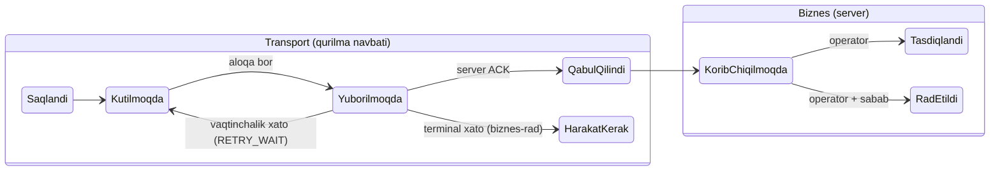
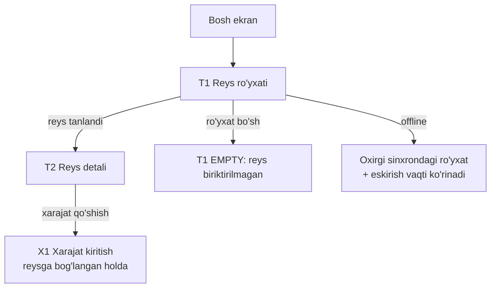
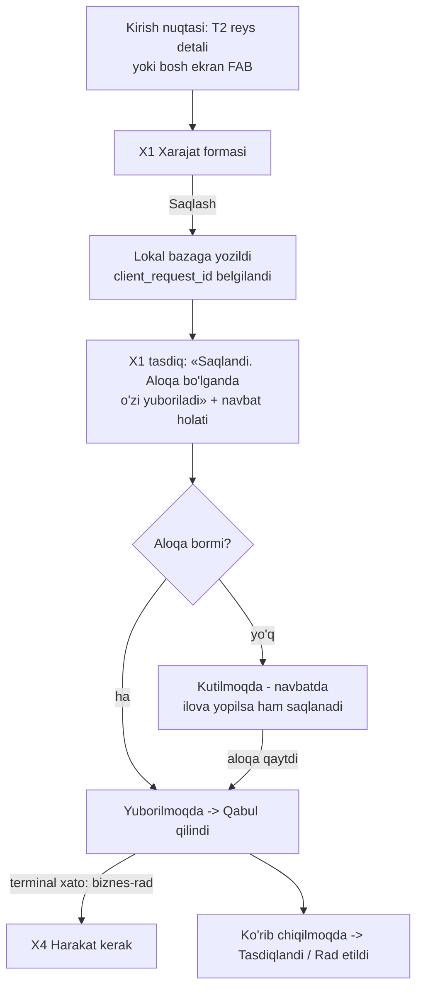

# DS-02 — Reys va xarajat oqimi

Teg konvensiyasi va holatlar katalogi: [`README.md`](README.md). Ekran spetsifikatsiyalari:
[`ds-02-ekranlar.md`](ds-02-ekranlar.md). Kirish oqimi (sessiya modeli, `A*` ekranlar):
[`ds-01-kirish-oqimi.md`](ds-01-kirish-oqimi.md).

> **Bog'liqlik eslatmasi.** [FAKT: `roadmap/tasks.md`] DS-02 `DC-02` (ADR-003 — terminal-xato
> siyosati) ga bog'liq. Siyosat egasining 2026-08-26 yozma qarori bilan yopilgan va ADR-003
> (`adr/ADR-003-offline-sync-terminal-errors.md`) sifatida qabul qilingan; bu hujjat o'sha
> siyosatga qurilgan.

## 0. Kanon chegaralar

- [FAKT: `domain/model.md`] `Trip` lifecycle: `PLANNED → ACTIVE → COMPLETED / CANCELLED`.
  `Expense` lifecycle: `DRAFT → SUBMITTED → APPROVED / REJECTED`; xarajat reysga bog'liq yoki
  umumiy bo'ladi.
- [FAKT: `roadmap/tasks.md` AN-05, B2 gate] MVP da haydovchi ilovasi reyslar bo'yicha **faqat
  o'qiydi**: operator reys ochadi, haydovchi ro'yxat va detalni ko'radi. Reysni boshlash/yakunlash
  haydovchi ilovasida MVP qamrovida yo'q.
- [FAKT: `product/business-rules.md` #6] Xarajat tasdiqsiz hisobga tushmaydi: haydovchi kiritadi
  → operator tasdiqlaydi → keyingina ledger. Tasdiq zanjiri summaga bog'liq (server tomonda).
- [FAKT: `product/business-rules.md` #4] Summa valyutasiz mavjud emas — har kiritish (miqdor,
  valyuta) juftligi.
- [FAKT: `product/business-rules.md` #7, #8] Offline yozuv yo'qolmaydi; har operatsiya
  `client_request_id` bilan idempotent — takror yuborish ikkinchi yozuv yaratmaydi.
- [FAKT: `roadmap/tasks.md` AN-02; `ai/MASTER_PROMPT.md` §10] Navbat mexanizmi holatlari:
  `PENDING → SENDING → ACKNOWLEDGED | RETRY_WAIT | REQUIRES_USER_ACTION`; cheklangan backoff;
  charchagan ish ko'rinadi, indamay tashlanmaydi.
- [FAKT: sessiya prompti] Haydovchiga halol ko'rsatiladi: yuborilmoqda / qabul qilindi /
  kutilmoqda / rad etildi. «Qabul qilindi» deyilgan ish hech qachon indamay yo'qolmaydi.
- [FAKT: `domain/model.md` §Keyinroq] `FileAsset` MVP dan tashqarida — chek foto MVP da yo'q.

## 1. Ikki qatlam — bitta halol hikoya

[TAKLIF] Haydovchi ko'radigan status ikki mustaqil haqiqatni birlashtiradi va dizayn ularni
hech qachon aralashtirmaydi:

**Transport qatlami** (yozuv ofisga yetdimi?) — `AN-02` mexanizm holatlaridan haydovchi tiliga
tarjima:

| Mexanizm holati | Haydovchi ko'radigan so'z | Ma'nosi |
|---|---|---|
| lokalga yozildi | **Saqlandi** | Qurilmada qabul qilindi; o'chmaydi. |
| `PENDING` / `RETRY_WAIT` | **Kutilmoqda** | Ofisga yuborish navbatда; aloqa qaytганда o'zi ketadi. |
| `SENDING` | **Yuborilmoqda** | Hozir ketmoqda. |
| `ACKNOWLEDGED` | **Qabul qilindi** | Ofis oldi. Endi qurilma o'chsa ham yozuv serverda. |
| `REQUIRES_USER_ACTION` | **Yuborib bo'lmadi — harakat kerak** | Terminal muammo; o'z-o'zidan hal bo'lmaydi. [FAKT: OPEN-002 yopilgan] Terminal = server aniq biznes-rad kodi qaytargan hol; yozuv haydovchida ham, operator konsolida ham ko'rinadi; tarmoq/server texnik xatolari hech qachon terminal emas (cheksiz sekin retry). |

**Biznes qatlami** (ofis xarajatga nima dedi?) — `Expense` lifecycle'idan:

| Server holati | Haydovchi ko'radigan so'z |
|---|---|
| `SUBMITTED` | **Ko'rib chiqilmoqda** |
| `APPROVED` | **Tasdiqlandi** |
| `REJECTED` | **Rad etildi** + operator sababi |

[TAKLIF] Qoida: biznes qatlam faqat `ACKNOWLEDGED` dan keyin boshlanadi va transport so'zlari
bilan bitta ustunda aralashmaydi — haydovchi «rad etildi» so'zini faqat **odam** (operator) rad
etganda ko'radi; texnik muvaffaqiyatsizlik hech qachon «rad etildi» deb atalmaydi.
[TAXMIN, `DC-03` tasdiqlaydi] `SUBMITTED/APPROVED/REJECTED` holatini klient serverdan o'qiydi
(pull yoki sync javobida) — mexanizmi kontraktda belgilanadi.

## 2. J5 — Reyslarni ko'rish

- [TAKLIF] Ro'yxat haydovchining **bugungi ishi** tartibida: `ACTIVE` reys eng tepada va vizual
  dominant; keyin `PLANNED` sanasi bo'yicha; `COMPLETED/CANCELLED` alohida, yig'ilgan bo'limda.
- [TAKLIF] Offline'da ro'yxat oxirgi muvaffaqiyatli sinxron nusxasi bilan ishlaydi va «qachongi
  holat» aniq ko'rinadi («Bugun 14:20 holati bo'yicha»). Bu xato emas, normal rejim.
- [TAXMIN, `DC-03` tasdiqlaydi] Ro'yxat serverdan sahifalab keladi (kontrakt pagination qoidasi);
  lokal keshda haydovchining joriy va yaqin reyslari to'liq turadi.
- [FAKT: tasks.md AN-05; OPEN-017 yopilgan, egasining qarori] MVP da reys harakatlarining
  aktyori faqat operator — haydovchi ilovasida boshlash/yakunlash tugmasi chizilmaydi.
  Haydovchi boshlash/yakunlash keyingi bosqich nomzodi; `T2` ga harakat paneli keyin qo'shiladi,
  bu dizayn joyini band qilib qo'ymaydi.

## 3. J6 — Xarajat kiritish (offline-first, asosiy stsenariy)

Bu — mahsulotning yuragi: yoqilg'i quyish shoxobchasida, qo'lqopda, aloqasiz hududda ishlashi
shart bo'lgan oqim.

Qadam niyatlari:

- [FAKT: `vision.md` §O'zgarmas 4] **Saqlash tugmasi tarmoqni kutmaydi.** Bosilishi bilan yozuv
  lokal bazada, tasdiq darhol; hech qanday spinner tarmoqqa qarab turmaydi.
- [TAKLIF] Tasdiq matni va'dani aniq beradi: «Saqlandi» (qurilmada) — «Qabul qilindi» (ofisда)
  farqi ekranда ko'rinadi. «Yuborildi» degan noaniq so'z ishlatilmaydi — halollik ikki so'zning
  farqида.
- [FAKT: `business-rules.md` #8] Takror bosish, retry, ilovani o'chirib yoqish — ikkinchi yozuv
  yaratmaydi (`client_request_id`). [TAKLIF] Shuning uchun UI da «qayta yuborish» tugmasi
  xavfsiz va har doim ko'rsatsa bo'ladi.
- [TAKLIF] Forma maydonlari (batafsil X1 da): summa + valyuta (majburiy juftlik), tur, reysga
  bog'lash (T2 dan kirilganda avtomatik), izoh. [FAKT: OPEN-015 yopilgan] Xarajat turi —
  **tizim lug'ati, majburiy**: server e'lon qiladi, klientga qotirib yozilmaydi; ro'yxatning
  o'zi `BK-07`/`DC-03` da.
- [FAKT: OPEN-014 yopilgan] Chek foto MVP da yo'q (`FileAsset` keyinroq); MVP siyosati — matn
  izoh + operatsion tartib («qog'oz chek davr yakunigacha saqlanib topshiriladi», onboarding
  materialida). Forma foto maydonisiz chiziladi, keyin qo'shishга joy bor.
- [FAKT: OPEN-016 yopilgan, egasining qarori] Xarajatning «tranzaksiya vaqti» — **haydovchi
  kiritgan lahza** (qurilma soati yozuvda ketadi, kurs o'sha sanaga muzlatiladi
  [FAKT: `business-rules.md` #3]). Server qurilma soatiga aqlga sig'arlik chegara tekshiruvini
  qo'yadi — aniq qoida `DC-03`/`BK-07` da.

## 4. J7 — Xarajatlarim va navbat holati

- [TAKLIF] Bitta ekran (X2) haydovchining hamma xarajatini ko'rsatadi — statusi bilan, ikki
  qatlam qoidasiga rioya qilib. Alohida «navbat» ekrani yo'q: haydovchi «navbat» tushunchasini
  o'rganmasligi kerak, u «xarajatlarim va ularning holati»ni ko'radi.
- [TAKLIF] `ConnectionStatusBar` (DS-01) navbat sonini butun ilovada tashiydi; bosilsa X2 ning
  «yuborilmaganlar» filtriga olib keladi.
- [FAKT: sessiya prompti] «Qabul qilindi» deyilgan ish keyin ro'yxatdan indamay g'oyib
  bo'lmaydi: operator rad etsa — «Rad etildi» + sabab bilan ko'rinadi; hech qanday holatda yozuv
  izsiz yo'qolmaydi.
- [TAKLIF] Rad etilgan xarajat bilan haydovchi nima qiladi (tuzatib qayta yuboradimi, yangi
  yozuv ochадимi) — [TAXMIN, `BK-07`/`DC-03` tasdiqlaydi] lifecycle'da `REJECTED` dan qaytish
  yo'li belgilanmagan; dizayn «yangi yozuv sifatida qaytadan kiritish» tugmasini beradi (eski
  yozuv tarixda qoladi, audit buzilmaydi [FAKT: `business-rules.md` #9 ruhida]).

## 5. J8 — Terminal xato («harakat kerak»)

[FAKT: `ai/MASTER_PROMPT.md` §10] Charchagan/terminal ish ko'rinadi, indamay tashlanmaydi.
[FAKT: `decisions.md` OPEN-002 yopilgan, egasining qarori 2026-08-26] Siyosat: **terminal —
faqat server aniq biznes-rad kodi bilan javob bergan hol** (masalan reys bekor qilingan,
qoida buzilgan); tarmoq va server texnik xatolari hech qachon terminal emas — ular cheksiz,
sekinlashuvchi retry bilan `Kutilmoqda`da qoladi. Terminal yozuv **ikkala tomonga ko'rinadi**
(haydovchida «harakat kerak», operator konsolida rad sifatida); haydovchi tuzatib **yangi
yozuv** sifatida qayta kiritadi (eski `client_request_id` qayta ishlatilmaydi — idempotency
kaliti bilan ziddiyat yo'q, eski yozuv tarixda qoladi); operator ham o'z tomonidan hal qila
oladi.

Struktura:

1. Terminal holatga tushgan yozuv X2 da alohida, e'tibor tortadigan bo'limда turadi va
   `ConnectionStatusBar` uni hisobga oladi.
2. X4 (harakat kerak ekrani) har doim uchta narsani aytadi: **nima saqlanib qolgan** (yozuv
   yo'qolmagan), **nima bo'lmadi** (ofisga yetmadi), **keyingi qadam kim tomonidan**.
3. Yozuvni o'chirish yoki tark etish hech qachon avtomatik emas — faqat haydovchining ochiq
   harakati bilan va DS-01 `DST` qoidalari bilan.
4. [FAKT: OPEN-002 yopilgan] «Keyingi qadam»: xato haydovchi tuzata oladigan bo'lsa —
   «Tuzatib qayta kiritish» (X1 oldindan to'ldirilgan, yangi yozuv); bo'lmasa — «Ofis ko'radi»
   (yozuv operator konsolida allaqachon ko'rinadi). Qaysi server kodlari terminal ro'yxatiga
   kirishi `DC-03` kontraktida sanab o'tiladi.

## 6. DS-02 dan chiqqan savollar — holati

Egasining 2026-08-26 qarorlari bilan yopildi (`decisions.md` §Yopilgan): chek/dalil siyosati
(OPEN-014 — matn izoh + operatsion tartib), xarajat turlari (OPEN-015 — tizim lug'ati,
majburiy), tranzaksiya vaqti (OPEN-016 — haydovchi kiritgan lahza), reys aktyori (OPEN-017 —
MVP da faqat operator).

Keyinchalik yopilgan (2026-08-26 qarorlari): terminal-xato siyosati (OPEN-002 — 5-bo'lim),
vaqt mintaqasi (OPEN-004 — kompaniya mintaqasi, standart Asia/Tashkent).

Ochiq qolgan: [SAVOL → `DC-03`] valyutalar ro'yxati va standart valyuta manbai (kompaniya
bazaviy valyutasimi, oxirgi ishlatilganmi — server aytadi); terminal kodlar ro'yxati ham
kontraktda sanab o'tiladi.
